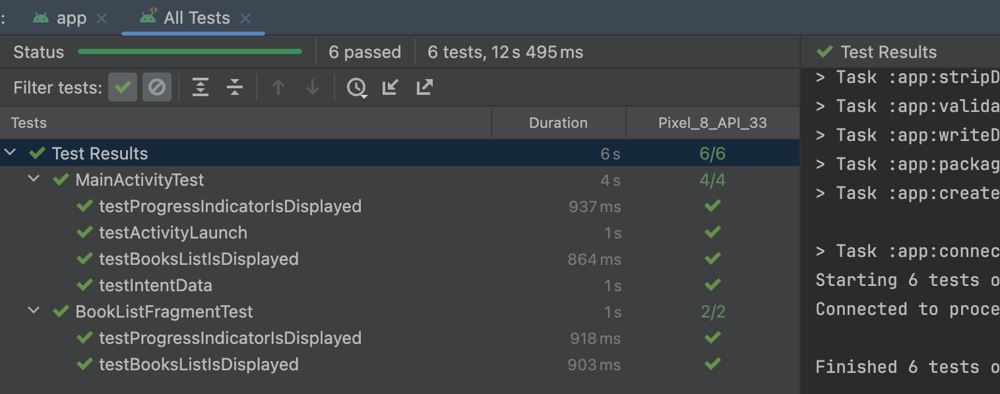

# OT Challenge

## Architecture

The application is structured using the MVP (Model-View-Presenter) architecture:

- **Model**: Represents the data layer, including the repository and API service.
- **View**: Represents the UI layer, including activities and fragments.
- **Presenter**: Acts as a middleman between the Model and the View, handling the business logic.

## Dependencies

The project uses the following dependencies:

- **AndroidX Core**: `androidx.core:core-ktx`
- **AppCompat**: `androidx.appcompat:appcompat`
- **Material Components**: `com.google.android.material:material`
- **Activity KTX**: `androidx.activity:activity-ktx`
- **ConstraintLayout**: `androidx.constraintlayout:constraintlayout`
- **Dagger**: `com.google.dagger:dagger` for dependency injection
- **Retrofit**: `com.squareup.retrofit2:retrofit` for networking
- **Gson Converter**: `com.squareup.retrofit2:converter-gson` for JSON parsing
- **Glide**: `com.github.bumptech.glide:glide` for image loading
- **OkHttp Logging Interceptor**: `com.squareup.okhttp3:logging-interceptor` for logging network requests
- **RxJava**: `io.reactivex.rxjava3:rxjava` for reactive programming
- **RxAndroid**: `io.reactivex.rxjava3:rxandroid` for Android-specific bindings
- **RxKotlin**: `io.reactivex.rxjava3:rxkotlin` for Kotlin extensions

## Setup

1. Clone the repository:
    ```sh
    git clone https://github.com/shreyasmp/otchallenge.git
    ```

2. Open the project in Android Studio.

3. Build the project to download all dependencies.

## Usage

- The main entry point of the application is `MainActivity`.
- The `BookPresenter` handles the business logic and interacts with the `BookRepository` to fetch data.
- The `BookRepositoryImpl` fetches data from the API using Retrofit.
- The `NetworkCallback` handles network connectivity changes.

## Screenshot/Video


